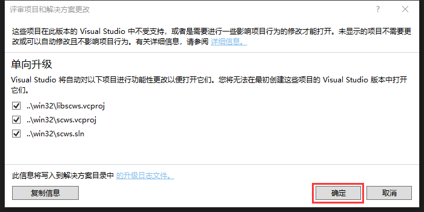
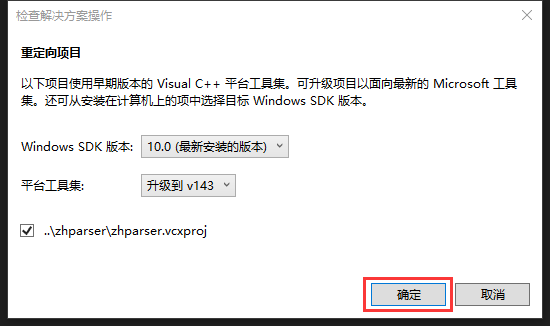
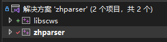
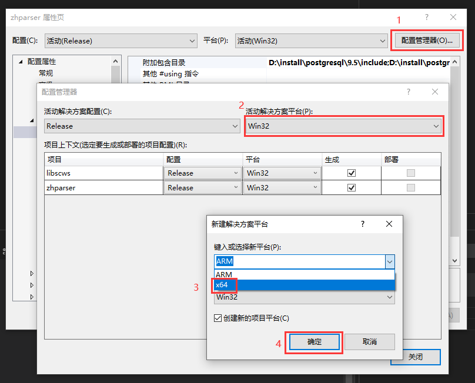
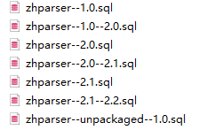

# 编译方法

1. 克隆已经用vs改进的工程：https://github.com/Gerrit1999/zhparser

2. 使用vs2010或以上的版本打开`zhparser\scws\win32\scws.sln`



3. 打开`zhparser\zhparser\zhparser.sln`



4. 此时可以看到vs也会把scws的工程加载进来



5. 修改编译配置支持x64



6. 先编译scws，生成`libscws.lib`静态库。
   
   1. 编译前，在libscws工程 `属性 --> C/C++ --> 常规 --> 附加包含目录`输入（路径要根据依赖软件的位置相应调整）：
      
	```
	E:\zhparser\scws\libscws;D:\PostgreSQL\10\include;D:\PostgreSQL\10\include\server;D:\PostgreSQL\10\include\server\utils;D:\PostgreSQL\10\include\server\port;%(AdditionalIncludeDirectories)
	```

7. 右键libscws工程，点击生成
   
   

8. 编译zhparser
   
   1. 将刚才编译完成的`zhparser\scws\Releas\libscws.lib`文件放到`zhparser\zhparser`根目录下
   
   2. 编译前，在zhparser工程 `属性 --> C/C++ --> 常规 --> 附加包含目录`输入（路径要根据依赖软件的位置相应调整）：
      
	```
	E:\zhparser\scws\libscws;D:\PostgreSQL\10\include;D:\PostgreSQL\10\include\server;D:\PostgreSQL\10\include\server\utils;D:\PostgreSQL\10\include\server\port;D:\PostgreSQL\10\include\server\port\win32;%(AdditionalIncludeDirectories)
	```

9. 在`属性 --> 链接器 --> 常规 --> 附加库目录`输入（路径要根据依赖软件的位置相应调整）：
   
	```
	D:\PostgreSQL\10\lib;E:\zhparser\zhparser;%(AdditionalLibraryDirectories)
	```

10. 右键zhparser工程，点击生成

11. 将编译完成的`zhparser\zhparser\x64\Release\zhparser.dll`文件复制到`D:\PostgreSQL\10\lib`中

12. 将`zhparser/zhparser.control`、`zhparser/*.sql`复制到`D:\PostgreSQL\10\share\extension`



13. 将`dict.utf8.xdb`、`rules.utf8.ini`复制到`D:\PostgreSQL\10\share\tsearch_data`

# 使用

1. 进入数据库，创建extension

```sql
CREATE EXTENSION zhparser;
```

2. 添加配置

```sql
CREATE TEXT SEARCH CONFIGURATION zh (PARSER = zhparser);
ALTER TEXT SEARCH CONFIGURATION zh ADD MAPPING FOR n,v,a,i,e,l WITH simple;

#查询已有的解析器
demo-# \dFp         
List of text search parsers   Schema   |   Name   |     Description     
------------+----------+--------------------- 
pg_catalog | default  | default word parser 
public     | zhparser | 
(2 rows)
```
